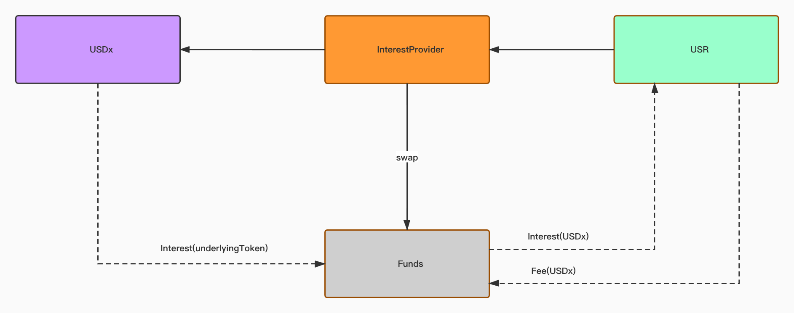
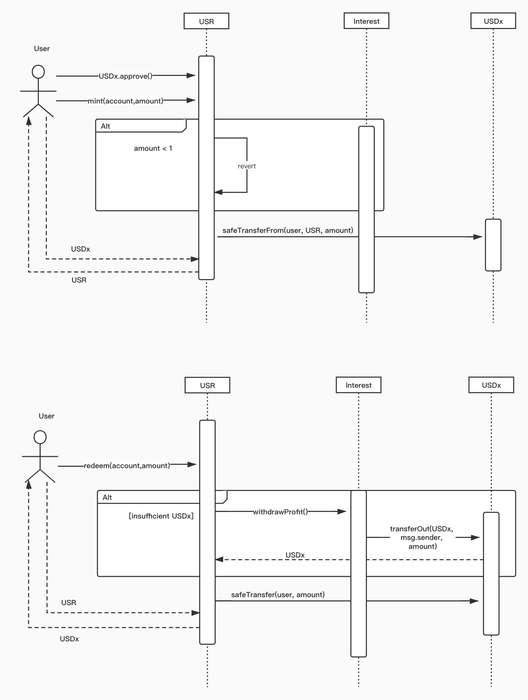

### USR V2

USR has updated:

- The exchange rate calculation of USR, it is updated to

```
exchangeRate = (principal + interest) / totalSupply;
```

- The principal is the total amount of `USDx` deposited into `USR`, it stays.
- The interest is generated by newly updated `USDx` contracts, which deposits underlying tokens into `dTokens` to earn interest.
- `USR` uses `InterestProvider` to interact with `USDx`, which provides more general interfaces to query and withdraw interest.
- The interest is stored in `Funds`, which accepts the underlying token and swap it to `USDx` as unified interest.

#### Audit scope

- The logic and calculation in USR.sol
  - mint(): saving USDx and get USR token
  - redeem()/redeemUnderlying(): redeem USDx by repaying USR token
- The security of users' assets

#### Audit Contracts

- Funds.sol
- InterestProvider.sol
- USR.sol

#### Diagrams




